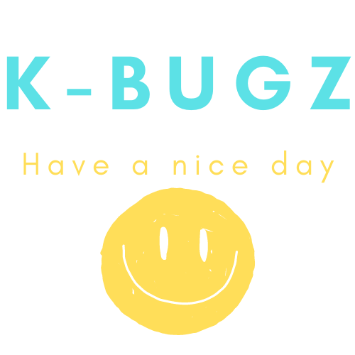

<h2 align="center">
Greetings, I am Kevin Bugusky
 
</h2>
<h3 align="center">
From Math & CS Educator 🏫 to to Full-Stack Web Developer 💻!!!
 
 
&ensp;&ensp;
&ensp;&ensp;

 

" width="15%">
</h3> 

<h2 align="center">
✨ Skills
</h2>

&ensp;
&ensp;
&ensp;
&ensp;
&ensp;
&ensp;
&ensp;

<h2 align="center">
📈 GitHub Stats 
</h2>

 
  Visitor count 
  

